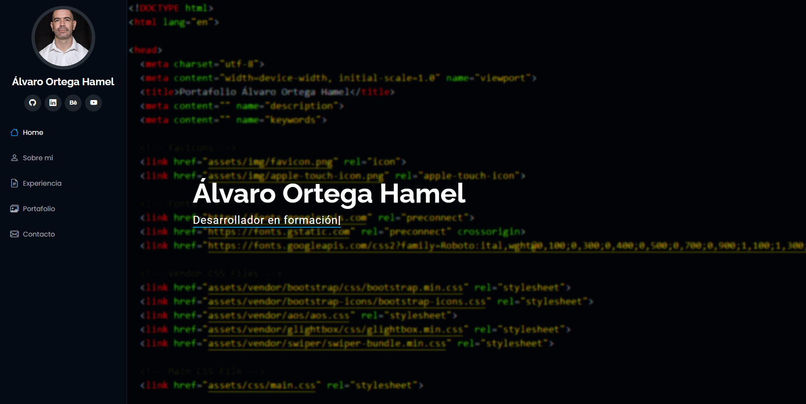

# Portafolio Personal

## Descripción

Este portafolio es un sitio web de presentación profesional que comunica de manera efectiva la transición de una sólida carrera en producción audiovisual (20 años de experiencia) hacia el campo del Desarrollo FullStack (Python/Django y JavaScript).

El sitio presenta una estructura modular y navegable, empleando un diseño adaptable (responsive) que facilita la visualización en cualquier dispositivo. Tras varias iteraciones de mejora, el producto final se caracteriza por ser una plataforma de evidencia técnica donde, además de mostrar los resultados, se detalla el proceso y la arquitectura de las soluciones desarrolladas. El enfoque actual garantiza no solo la estética, sino también una experiencia de usuario fluida y profesional.

🔗 **Sitio en línea:** [https://ortegahamel.github.io/Portfolio/](https://ortegahamel.github.io/Portfolio/)  
💻 **Repositorio GitHub:** [https://github.com/OrtegaHamel/Portfolio](https://github.com/OrtegaHamel/Portfolio)

---

## 👤 Sobre mí

Soy **Álvaro Ortega Hamel**, desarrollador FullStack con experiencia en **Python/Django** y **JavaScript**, formado en dos bootcamps intensivos donde desarrollé proyectos aplicando metodologías ágiles, control de versiones con Git/GitHub y despliegue web con GitHub Pages.

Durante más de 20 años trabajé en el ámbito audiovisual, lo que me permitió fortalecer habilidades como la creatividad, resolución de problemas, liderazgo y trabajo en equipo. Actualmente, aplico esta experiencia en el desarrollo de soluciones web funcionales y bien estructuradas.

---

## 🚀 Proyectos Destacados

- [**API Star Wars**](https://github.com/OrtegaHamel/M04Consolidacion)  
  página web interactiva desarrollada con HTML, CSS y JavaScript, que muestra información de personajes del universo Star Wars utilizando datos obtenidos desde la API pública SWAPI.

- [**Aplicación web con Django**](https://github.com/OrtegaHamel/Portafolio_Modulo6.git)  
  Aplicación diseñada para gestionar productos y usuarios. Incluye funcionalidades como autenticación, autorización, gestión de productos, y un panel de administración personalizado para gestionar usuarios y permisos.

- [**Aplicación web para gestionar tareas**](https://github.com/OrtegaHamel/Evaluacion_Modulo6.git)  
  Proyecto que integra conocimientos de desarrollo Frontend con validación de formularios, interacción con el DOM y diseño responsivo.

---

## 🧰 Tecnologías Utilizadas

- **Frontend:** HTML5, CSS3, JavaScript, Bootstrap, jQuery  
- **Backend:** Python, Django, Node.js, Express  
- **Base de Datos:** PostgreSQL, MySQL  
- **Herramientas:** Git, GitHub, Visual Studio Code  
- **Despliegue:** GitHub Pages, Render

---

## 🎨 Plantilla

Template Name: **iPortfolio**  
Template URL: [https://bootstrapmade.com/iportfolio-bootstrap-portfolio-websites-template/](https://bootstrapmade.com/iportfolio-bootstrap-portfolio-websites-template/)  
Author: **BootstrapMade.com**  
License: [https://bootstrapmade.com/license/](https://bootstrapmade.com/license/)